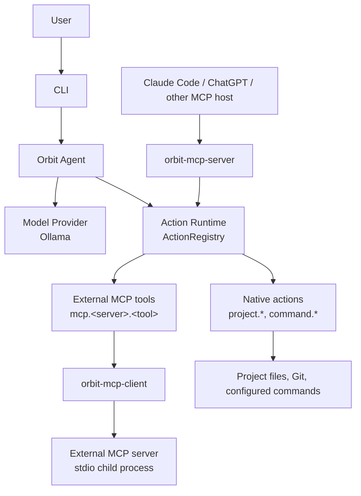
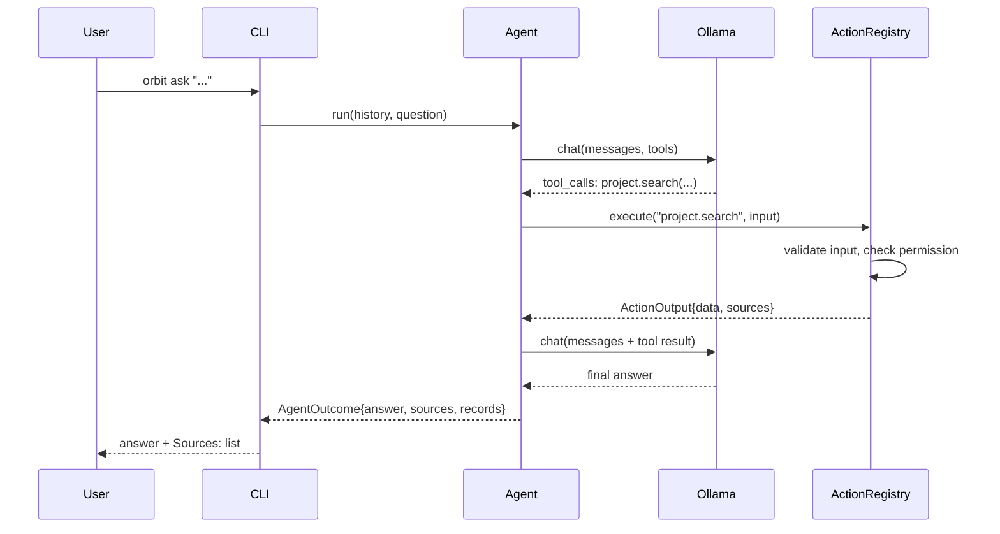

# Architecture

Orbit owns the agent and the actions. MCP only imports and exports
capabilities — it is an adapter at the edge, never the internal execution
mechanism.

## Layers



The Orbit agent calls the Action Runtime **directly**. It does not connect
to Orbit's own MCP server to run a native action — `orbit-mcp-server`
exists purely so *external* hosts can reach the same actions, filtered by
`mcp.expose`.

## Crates

```text
crates/
├── core         shared types: messages, model requests/responses, actions,
│                permissions, sources, execution records, errors
├── project      .orbit/project.yaml, root discovery, path/exclude
│                security, file discovery, deterministic search
├── actions      Action trait + ActionRegistry + the six native actions
├── providers    ModelProvider trait, Ollama provider, mock provider
├── agent        the tool-calling loop; merges native + external-MCP
│                actions into one registry for a session
├── mcp-client   Orbit as an MCP client (consumes external stdio servers)
├── mcp-server   Orbit as an MCP server (exposes filtered native actions)
└── cli          the `orbit` binary
```

Dependency direction (no cycles):

```text
core
├── project
├── actions   (project)
└── providers

agent
├── core, actions, providers
└── mcp-client

mcp-server → actions (+ core)
mcp-client → actions, project (+ core)

cli → agent, mcp-server, actions, providers, project, core
```

`orbit-actions`' public API has no MCP types in it. `orbit-agent` depends
on `orbit-mcp-client` (to consume external servers as a session starts) but
never on `orbit-mcp-server`. Ollama-specific wire types stay inside
`orbit-providers::ollama` and never appear in `orbit-core` or `orbit-agent`.

## Request flow (`orbit ask`)



Every tool call goes through the same `ActionRegistry::execute`: input
validation, then permission enforcement (`allow`/`ask`/`deny`), then
execution, then an `ExecutionRecord`. The model can request an action; it
can never grant itself permission to run one.

### Deterministic retrieval for broad questions

A small local model does not reliably decide, on its own, to call the
right tools for a vague question like "What does this repository do?" —
there is no keyword in the question itself to search for. For questions
matching that shape, `orbit-agent::retrieval` runs `project.information`
→ `project.read_file` (on whichever overview-shaped docs actually exist —
README, CLAUDE.md, a spec under `docs/`, ranked by an adaptive heuristic
over the real file list) *before* the model's first turn, through the
exact same `ActionRegistry::execute` a model-initiated call would use —
same permission enforcement, same execution records. The model still
sees these as ordinary tool-call/tool-result messages; it just doesn't
have to have decided to make them. Everything else (a specific question
like "why was the ESP32-C3 selected?") is left entirely to the model's
own tool-calling.

An earlier version of this also ran `project.search` for the project's
own name as a third step. It was removed: a bare project name is often a
generic word, so that search matched incidental substrings in unrelated
files (e.g. a dependency manifest's `repository = ".../assistant"` line)
and those became noisy, irrelevant entries in the final answer's sources.
`project.read_file` on ranked overview docs is precise by construction;
a bare keyword search on the project's own name is not. Source quality is
also enforced on the way out — see `dedupe_sources` in
`crates/agent/src/agent.rs`: exact duplicates are dropped, a path-only
reference is dropped in favor of a more precise line-ranged reference to
the same file when both exist, and the model's answer text can never add
a source that wasn't actually returned by an executed action.

## MCP: both directions

- **Server** (`orbit mcp serve`): wraps `ActionRegistry` behind the MCP
  `stdio` transport. `list_tools`/`call_tool` are the only two things it
  adds; everything else — validation, permissions, execution — is the same
  code path the CLI and agent use. Only `mcp.expose` entries whose
  *effective permission is `allow`* are visible: `orbit-mcp-server::exposure`
  resolves this once at startup (same `effective_permission` every other
  layer uses), excluding `deny` outright and `ask` because this transport
  has no interactive confirmation — see [MCP.md](MCP.md) for the exact
  behavior and the warnings `orbit doctor`/`orbit mcp serve` produce for
  each excluded entry.
- **Client** (`orbit-mcp-client`, used by `orbit ask`/`orbit chat`):
  connects to each enabled server under `mcp.servers`, lists its tools, and
  wraps each one as an ordinary `Action` named `mcp.<server>.<tool>`. These
  get registered into the *same* `ActionRegistry` as native actions, so
  permission enforcement, execution records, and the agent loop do not
  need to know an action came from outside Orbit. A server that fails to
  start produces a warning, not a crash — the rest of the session still
  works.

See [MCP.md](MCP.md) for configuration and the Claude Code connection.

## What is not built yet

- Anthropic/OpenAI providers (the trait supports adding them without
  touching the agent).
- A desktop application or voice interface (the CLI is a thin layer over
  `orbit-agent`; neither interface requires moving agent logic).
- Persistent conversation memory (`orbit chat` keeps history in process
  memory only, by design — see [SECURITY.md](SECURITY.md)).
- A vector database or embedding-based search (local search in
  `orbit-project::search` is deterministic and file-based).
