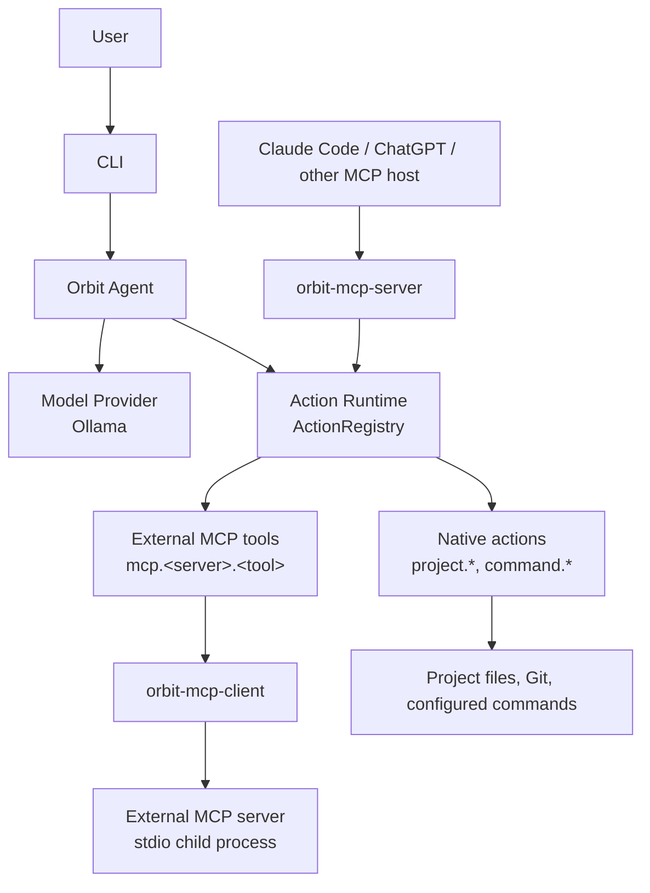
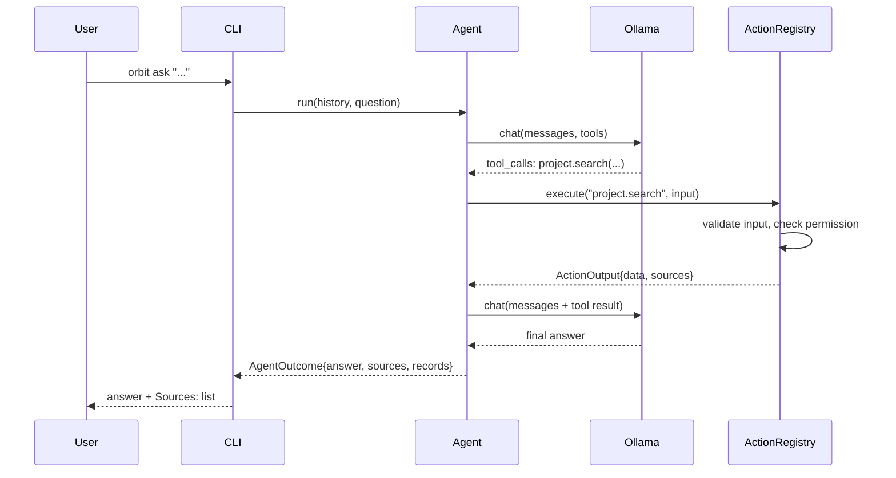
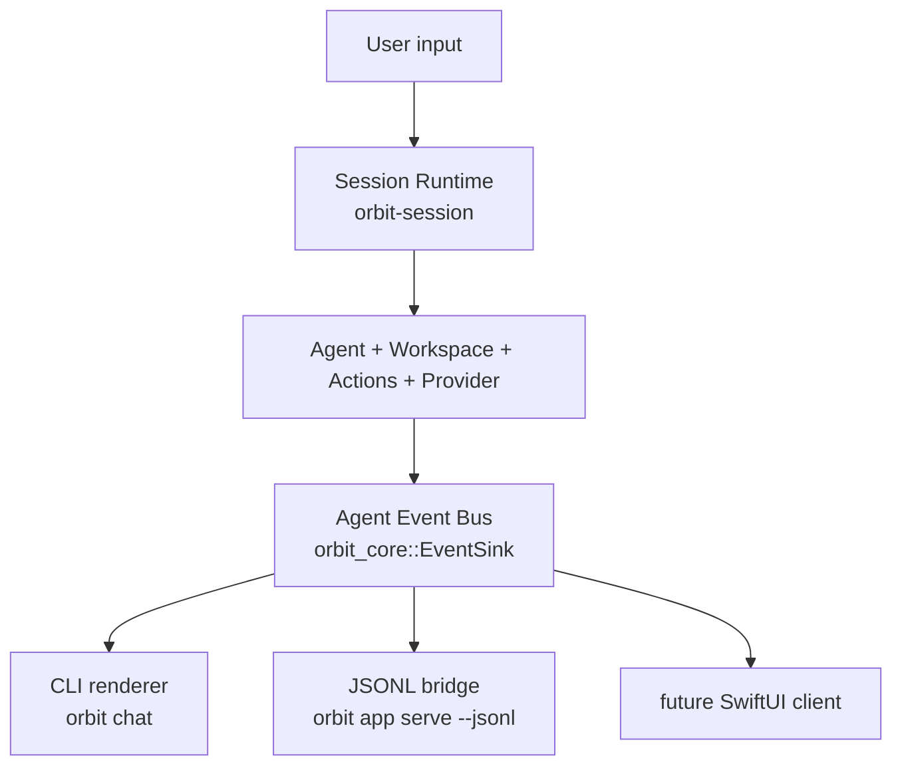

# Architecture

Orbit owns the agent and the actions. MCP only imports and exports
capabilities — it is an adapter at the edge, never the internal execution
mechanism.

## Layers



The Orbit agent calls the Action Runtime **directly**. It does not connect
to Orbit's own MCP server to run a native action — `orbit-mcp-server`
exists purely so *external* hosts can reach the same actions, filtered by
`mcp.expose`.

## Crates

```text
crates/
├── core         shared types: messages, model requests/responses, actions,
│                permissions, sources, execution records, errors
├── project      .orbit/project.yaml, root discovery, path/exclude
│                security, file discovery, tokenization, query
│                analysis, and deterministic lexical search
├── actions      Action trait + ActionRegistry + the six native actions
├── providers    ModelProvider trait, Ollama provider, mock provider
├── agent        the tool-calling loop; merges native + external-MCP
│                actions into one registry for a session
├── mcp-client   Orbit as an MCP client (consumes external stdio servers)
├── mcp-server   Orbit as an MCP server (exposes filtered native actions)
├── workspace    orchestration over several sibling Project Runtimes:
│                .orbit/workspace.yaml, ProjectRegistry, the six
│                workspace.* actions, deterministic multi-project
│                retrieval -- see WORKSPACES.md
├── session      stateful multi-turn sessions: conversation state, turn
│                orchestration, project switching, permission pausing,
│                cancellation -- see SESSIONS.md
└── cli          the `orbit` binary (terminal renderer + JSONL bridge)
```

Dependency direction (no cycles):

```text
core
├── project
├── actions   (project)
└── providers

agent
├── core, actions, providers
└── mcp-client

mcp-server → actions (+ core)
mcp-client → actions, project (+ core)

workspace → core, project, actions (+ agent's retrieval pattern, not
            agent itself -- see below)

session → core, project, actions, providers, agent, workspace

cli → agent, mcp-server, actions, providers, project, core, workspace,
      session
```

`orbit-actions`' public API has no MCP types in it. `orbit-agent` depends
on `orbit-mcp-client` (to consume external servers as a session starts) but
never on `orbit-mcp-server`. Ollama-specific wire types stay inside
`orbit-providers::ollama` and never appear in `orbit-core` or `orbit-agent`.
`orbit-workspace` does not depend on `orbit-agent` — it builds per-project
`ActionContext`s and calls the shared `ActionRegistry::execute`, the same
entry point `orbit-agent` itself uses, rather than driving an `Agent`
instance directly. The CLI is what wires a workspace's deterministic
retrieval output and an `Agent` together for `orbit ask`/`orbit chat` (see
[WORKSPACES.md](WORKSPACES.md)).

## Request flow (`orbit ask`)



Every tool call goes through the same `ActionRegistry::execute`: input
validation, then permission enforcement (`allow`/`ask`/`deny`), then
execution, then an `ExecutionRecord`. The model can request an action; it
can never grant itself permission to run one.

See [SEARCH.md](SEARCH.md) for the retrieval pipeline: tokenization,
query analysis, BM25 ranking, conversational topic state, progressive
file reads, and the grounding policy.

### Deterministic retrieval

A small local model does not reliably decide, on its own, to call the
right tools for a vague question like "What does this repository do?" —
there is no keyword in the question itself to search for. For questions
matching that shape, `orbit-agent::retrieval` runs `project.information`
→ `project.read_file` (on whichever overview-shaped docs actually exist —
README, CLAUDE.md, a spec under `docs/`, ranked by an adaptive heuristic
over the real file list) *before* the model's first turn, through the
exact same `ActionRegistry::execute` a model-initiated call would use —
same permission enforcement, same execution records. The model still
sees these as ordinary tool-call/tool-result messages; it just doesn't
have to have decided to make them. Everything else (a specific question
like "why was the ESP32-C3 selected?") is left entirely to the model's
own tool-calling.

An earlier version of this also ran `project.search` for the project's
own name as a third step. It was removed: a bare project name is often a
generic word, so that search matched incidental substrings in unrelated
files (e.g. a dependency manifest's `repository = ".../assistant"` line)
and those became noisy, irrelevant entries in the final answer's sources.
`project.read_file` on ranked overview docs is precise by construction;
a bare keyword search on the project's own name is not. Source quality is
also enforced on the way out — see `dedupe_sources` in
`crates/agent/src/agent.rs`: exact duplicates are dropped, a path-only
reference is dropped in favor of a more precise line-ranged reference to
the same file when both exist, and the model's answer text can never add
a source that wasn't actually returned by an executed action.

## MCP: both directions

- **Server** (`orbit mcp serve`): wraps `ActionRegistry` behind the MCP
  `stdio` transport. `list_tools`/`call_tool` are the only two things it
  adds; everything else — validation, permissions, execution — is the same
  code path the CLI and agent use. Only `mcp.expose` entries whose
  *effective permission is `allow`* are visible: `orbit-mcp-server::exposure`
  resolves this once at startup (same `effective_permission` every other
  layer uses), excluding `deny` outright and `ask` because this transport
  has no interactive confirmation — see [MCP.md](MCP.md) for the exact
  behavior and the warnings `orbit doctor`/`orbit mcp serve` produce for
  each excluded entry.
- **Client** (`orbit-mcp-client`, used by `orbit ask`/`orbit chat`):
  connects to each enabled server under `mcp.servers`, lists its tools, and
  wraps each one as an ordinary `Action` named `mcp.<server>.<tool>`. These
  get registered into the *same* `ActionRegistry` as native actions, so
  permission enforcement, execution records, and the agent loop do not
  need to know an action came from outside Orbit. A server that fails to
  start produces a warning, not a crash — the rest of the session still
  works.

See [MCP.md](MCP.md) for configuration and the Claude Code connection.

## Workspaces: orchestration, not a merged filesystem

`orbit-workspace` sits one layer above everything described so far,
never inside it:

```text
Workspace Runtime (orbit-workspace)
    |
Project Registry (name/alias resolution, per-project availability)
    |
One or more selected Project Runtimes (each project's own ActionContext)
    |
Existing Action Runtime (orbit-actions, unmodified)
```

A workspace never merges sibling repositories into one filesystem root.
Each registered project keeps its own canonical root, its own loaded
`.orbit/project.yaml`, and its own security boundary; `orbit-workspace`'s
six `workspace.*` actions are thin orchestrators that resolve which
project(s) a request targets and then call the *same*
`ActionRegistry::execute` a single-project session would, against a fresh
`ActionContext` built from that project's own configuration — no native
project logic is duplicated. `orbit-mcp-server` needed zero changes to
support workspace mode: its exposure/permission machinery already only
depends on a generic `ActionRegistry` + `ActionContext`, not on anything
project-specific. See [WORKSPACES.md](WORKSPACES.md) for the full design:
discovery precedence, name/alias resolution, natural-language routing,
context budgeting, multi-project sources, and permission isolation.

## Sessions and the Agent Event Stream

`orbit-session` adds stateful, multi-turn conversations on top of the
agent, and `orbit-core::event` adds the structured stream through which
every front end observes them:



The rule this enforces is that **agent logic never lives in a renderer or
a wire protocol**. `orbit chat` and the JSONL bridge are both pure
consumers of the same events; neither contains retrieval, permission
policy, or a tool-calling loop, and adding a third front end requires no
change to any of them.

Two consequences worth noting:

- **Events are emitted from the Action Runtime, not around it.**
  `ActionRegistry::execute_observed` is the same code path as
  `execute` (which simply passes a null emitter), because only that path
  knows when validation passed and when a permission check resolved.
  Observing a session therefore cannot diverge from running one, and no
  execution logic is duplicated to produce events.
- **`ConfirmationProvider` is async.** Obtaining an `ask` decision
  genuinely is asynchronous — a session must be able to pause an action,
  emit `permission_required`, and resume only when a real decision
  arrives, without blocking the runtime thread the rest of the session
  runs on.

Streaming is part of the provider abstraction rather than of Ollama:
`ModelProvider::chat_streaming` has a default implementation that
delegates to `chat` and reports the whole answer as a single delta, so a
non-streaming provider stays fully usable and front ends need only one
rendering path. See [SESSIONS.md](SESSIONS.md), [EVENTS.md](EVENTS.md),
and [APP_PROTOCOL.md](APP_PROTOCOL.md).

## What is not built yet

- Anthropic/OpenAI providers (the trait supports adding them without
  touching the agent).
- A desktop application or voice interface. The foundation they need —
  stateful sessions, the event stream, streaming responses, structured
  permissions, cancellation, and the JSONL bridge — is built; the
  SwiftUI app, microphone capture, speech recognition, text-to-speech,
  and wake-word detection are not.
- Persistent conversation memory (sessions keep history in process
  memory only, by design — see [SESSIONS.md](SESSIONS.md) and
  [SECURITY.md](SECURITY.md)).
- A vector database or embedding-based search (local search in
  `orbit-project::search` is deterministic and file-based).
